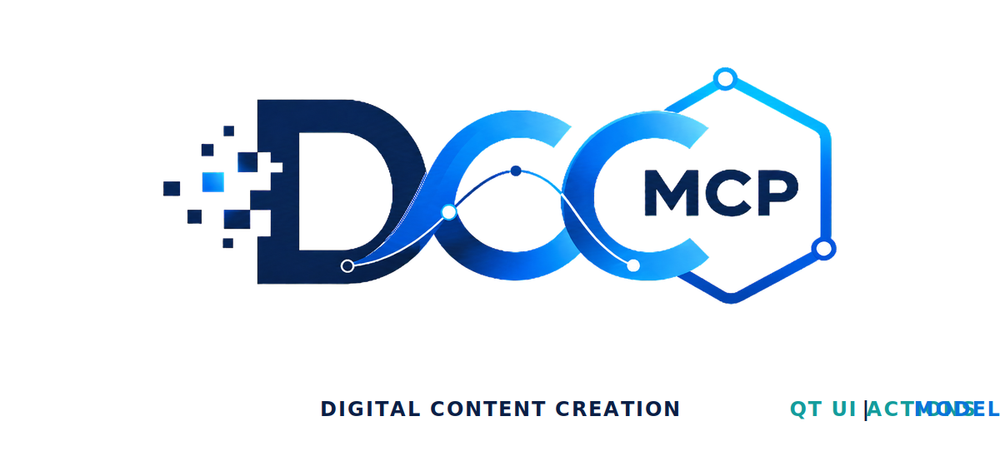
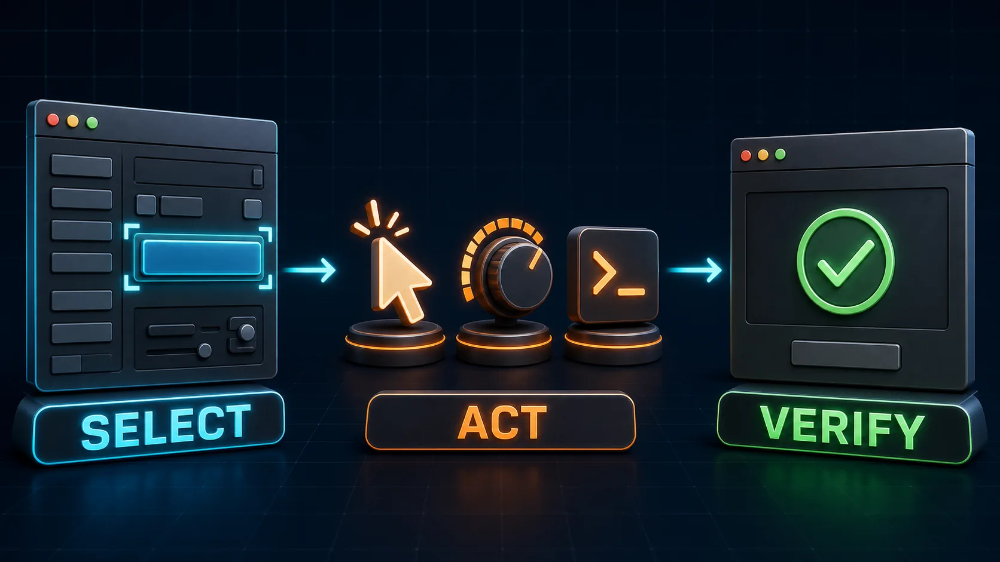

# DCC-MCP Qt UI Actions

<p align="center">
  
</p>

## Agent workflow

AI agents should use installed package skills through the shared gateway. IDE
users may continue to use the MCP endpoint.

```bash
dcc-mcp-cli dcc-types
dcc-mcp-cli list
dcc-mcp-cli search --query "<task>" --dcc-type <host>
dcc-mcp-cli describe <tool-slug>
dcc-mcp-cli call <tool-slug> --json '{"key":"value"}'
```

If the package skill is not active, call
`dcc-mcp-cli load-skill <skill-name> --dcc-type <host>`. After the task,
query `dcc-mcp-cli stats --range 24h --session-id <task-id>` and pass only
bounded evidence to the `review_skill_improvement` prompt from
`dcc-mcp-skills-creator`.




Reusable Qt UI actions for DCC-MCP.

Use this skill when a legacy Qt tool has no agent-friendly API and must be
driven through its UI. Prefer `widget_id`, object name, class name, or QAction
text. Coordinates are intentionally not a first-class contract.

## Install

```bash
dcc-mcp-cli marketplace add dcc-mcp/dcc-ui-qt-actions
dcc-mcp-cli marketplace install dcc-ui-qt-actions
```

## Tools

- `click_widget`
- `trigger_action`
- `set_widget_value`
- `process_events`
- `screenshot_widget`

Use `dcc-ui-qt-inspector` first to discover stable selectors.
